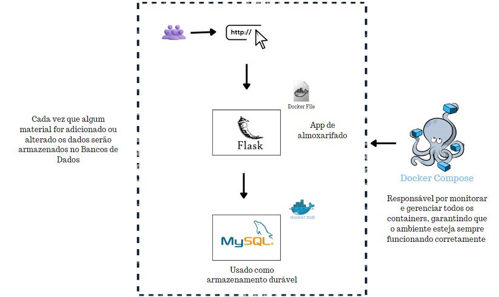

# CRUD de almoxarifado

Este é um projeto exemplo que tem como objetivo demonstrar como utilizar Docker, Dockerfile e Docker Compose para desenvolver e executar um projeto de microserviços em sua máquina local. 


## Pré-requisitos

Antes de prosseguir, certifique-se de ter os seguintes softwares instalados em sua máquina:

- Docker
- Docker Compose
- (Para facilitar a visualização é recomendado o uso de ferramentas para banco de dados, como DBeaver ou SQLDeveloper;
   e uma ferramenta de plataforma de API's, como: Postman ou Insomnia)


## Clonando o repositório

Para clonar o repositório, execute o seguinte comando no terminal:

```
bash
git clone https://github.com/GuilherSil/CP2-Devops.git
```


## Dockerfile

O Dockerfile é um arquivo que contém as instruções para criar uma imagem do Docker. No nosso projeto, temos um Dockerfile que será utilizado para criar a imagem correspondente.


## Docker Compose

O Docker Compose é uma ferramenta que permite gerenciar múltiplos contêineres do Docker como um único serviço. No nosso projeto, utilizamos o Docker Compose para gerenciar os serviços.


## Executando o projeto

Após clonar o repositório, entre na pasta do projeto executando o comando 'cd CP2-Devops'.
Abra o arquivo .env na raiz do projeto com o comando 'nano .env' e configure as variáveis de ambiente conforme a sua necessidade. As variáveis que precisam ser configuradas são:

'MYSQL_ROOT_PASSWORD': senha do usuário root do MySQL.
'MYSQL_USER': nome do usuário que será criado para acessar o banco de dados.
'MYSQL_PASSWORD': senha do usuário que será criado para acessar o banco de dados.
'MYSQL_DATABASE': nome do banco de dados que será criado.

Salve o arquivo .env e saia do editor de texto.


Abra o arquivo 'docker-compose.yml' e verifique se as configurações estão de acordo com a sua necessidade. Neste arquivo estão definidos os serviços que serão executados pelo Docker Compose. O serviço do banco de dados MySQL local já está configurado, mas se você precisar adicionar outros serviços, basta incluí-los neste arquivo.

Execute o comando 'docker-compose up --build' dentro do diretório onde está o arquivo 'docker-compose.yml' para criar os containers e iniciar os serviços definidos no arquivo docker-compose.yml.

Verifique se os containers estão em execução com o comando 'docker ps'.

Se sim, o banco de dados local já pode ser acessado com uma persistência e possuindo uma api que envia solicitações através das url's locais definidas no arquivo app.py dentro da pasta api.

## Encerrando o projeto

Para encerrar o projeto, execute o seguinte comando:

```bash
docker-compose down
```

Este comando irá encerrar todos os serviços e seus contêineres correspondentes.


## Arquitetura do projeto 



